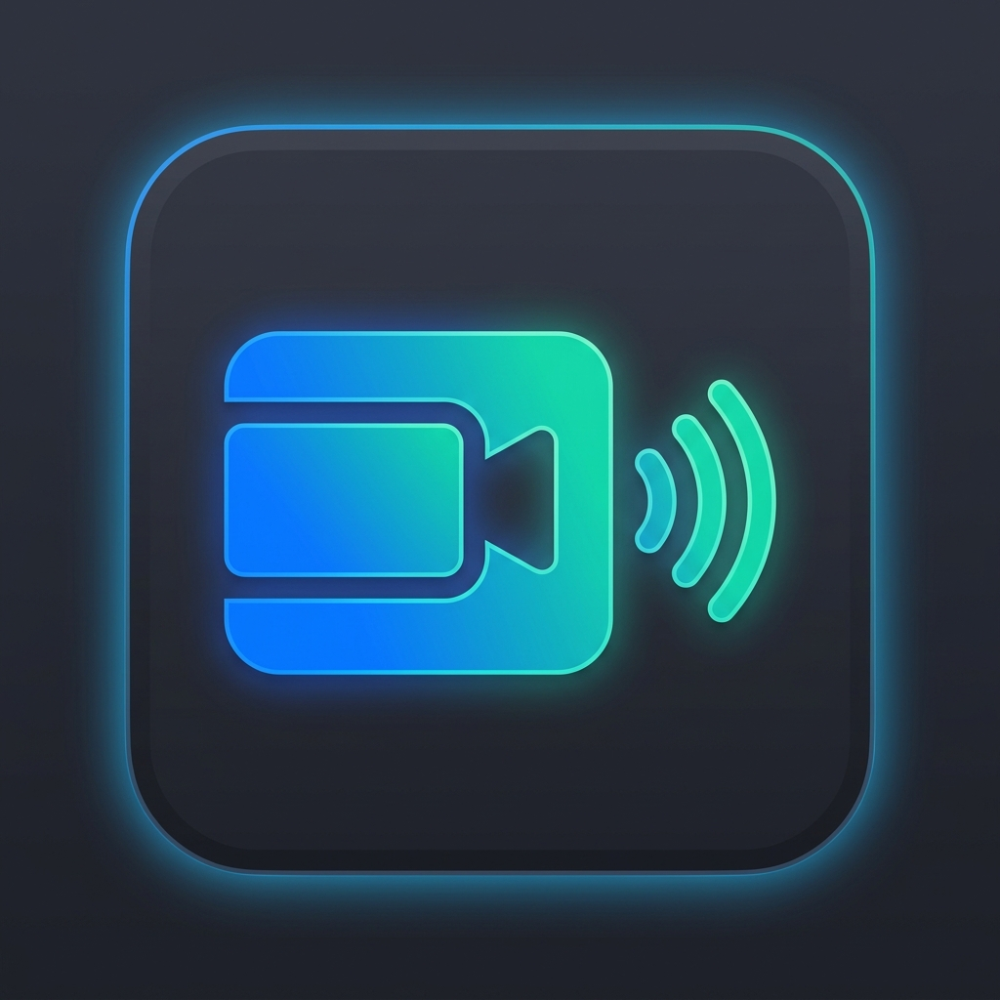

  

<h1 align="center">🌐 AtikMeet</h1>

  <strong>Premium & Lightweight Video Conferencing Desktop Application</strong> 
  <em>Secure, Low-Latency P2P Video Calls, 1080p Screen Sharing, and Meeting Moderation out of the box.</em>

  
  
  
  

---

## 🌟 Why AtikMeet? (কেন AtikMeet ব্যবহার করবেন?)

AtikMeet combines the simplicity of Google Meet with the power of a native desktop application. Whether you want to host private video conferences for friends, family, or work, AtikMeet provides a secure, self-hosted option without time limits.

*   **🔒 Peer-to-Peer Security (P2P):** Calls go directly between you and your participants. Your data remains private.
*   **⏱️ Unlimited Duration:** No 40-minute limits! Host meetings as long as you want, completely free.
*   **🖥️ Ultra-HD Screen Sharing:** Share your screen in crisp 1080p resolution with system audio.
*   **👥 Up to 150 Participants:** Powerful room control supporting large group meetings.
*   **👑 Host Controls (Lobby/Waiting Room):** Approve or deny participants before they enter the meeting.
*   **🌐 No Install for Guests:** Your friends can join directly from their web browsers on their computers or phones!

---

## 📥 Download AtikMeet (ডাউনলোড করুন)

Get the latest version of AtikMeet and start hosting your meetings instantly:

  

> [!TIP]
> Just download the `.exe` setup file, run the installation wizard, and you are ready to launch! No configuration required.

---

## 📱 How It Works (কীভাবে কাজ করে)

1.  **Create a Meeting:** Launch the AtikMeet desktop app and click **"Create Meeting"** to instantly generate a meeting ID.
2.  **Share the Link:** Copy the meeting link (e.g. `http://your-ip:3478/meeting/xxxx-yyyy`) and send it to your friends.
3.  **Approve Guests:** When guests join, they will wait in the lobby. As the host, you can click **"Admit"** to let them in.
4.  **Enjoy the Call:** Speak, turn on your video, share your screen, send chat messages, and use cool reactions!

---

## 📁 Project Structure (প্রজেক্ট ফোল্ডার ডিজাইন)

*   `main.js` & `preload.js` — Core Electron desktop window shell & security integrations.
*   `server-standalone.js` — Standalone Node background signaling server (Socket.io).
*   `src/pages` — Clean & beautiful responsive UI layouts.
*   `src/js` — WebRTC calling, screen-recording, chat, and licensing engine.
*   `src/utils/db.js` — Zero-configuration local database (lowdb) to manage credentials and roles.

---

## 📞 Support & Contact (যোগাযোগ)

If you need any support, customized features, or license activation keys, feel free to contact us:

*   **📧 Developer Email:** [atiksoykot979@gmail.com](mailto:atiksoykot979@gmail.com)
*   **🏢 Developed By:** **Atik Shahriar**

---

## 📄 License
This project is open-source and licensed under the MIT License.
